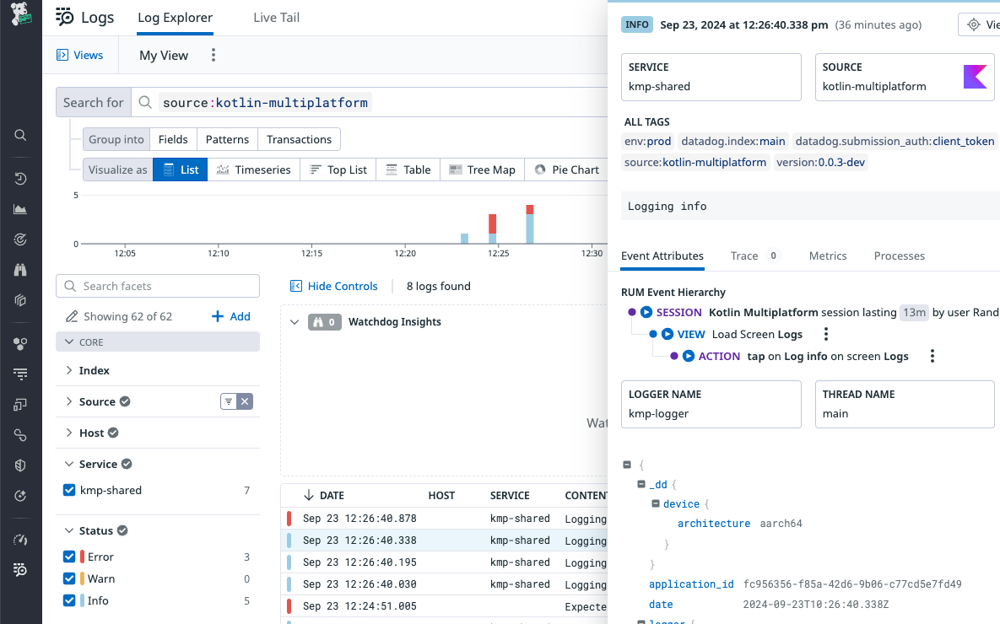
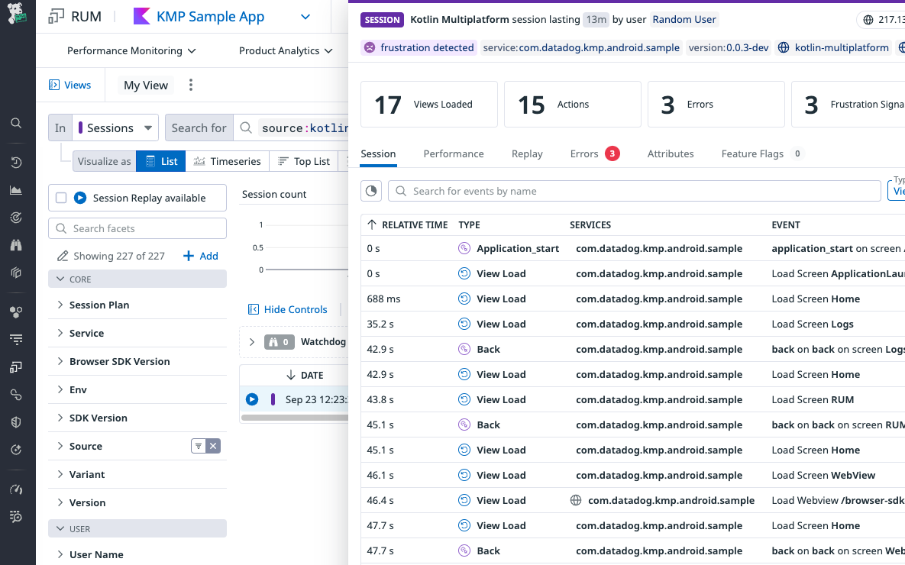

# Datadog SDK for Kotlin Multiplatform

> A client-side Kotlin Multiplatform library to interact with Datadog.

## Supported platforms

| Platform             | Version |
|----------------------|---------|
| Android / Android TV | API 21+ |
| iOS / iPadOS / tvOS  | 12+     |

**Note**: Session Replay and WebView tracking are not supported on `tvOS`.

## Getting Started

### Log Collection

See the dedicated [Datadog Kotlin Multiplatform Log Collection documentation][1] to learn how to forward logs from your Kotlin Multiplatform application to Datadog.

### Real User Monitoring

See the dedicated [Datadog Kotlin Multiplatform RUM Collection documentation][2] to learn how to send RUM data from your Kotlin Multiplatform application to Datadog.

## RUM Integrations

### Ktor

If you use Ktor to make network requests in your application, see Datadog's [dedicated library](integrations/ktor/README.md).

## Looking up your logs

When you open your console in Datadog, navigate to the [Log Explorer][3]. In the search bar, type `source:kotlin-multiplatform`. This filters your logs to only show the ones coming from Kotlin Multiplatform applications.

## Looking up your RUM events

When you open your console in Datadog, navigate to the [RUM Explorer][4]. In the side bar, you can select your application and explore Sessions, Views, Actions, Errors, Resources, and Long Tasks.

## Troubleshooting

If you encounter any issue when using the Datadog SDK for Kotlin Multiplatform, please take a look at
the [troubleshooting checklist][5], or at
the existing [issues](https://github.com/DataDog/dd-sdk-kotlin-multiplatform/issues?q=is%3Aissue).

## Contributing

Pull requests are welcome. First, open an issue to discuss what you would like to change. For more information, read the [Contributing Guide](CONTRIBUTING.md).

## License

[Apache License, v2.0](LICENSE)

[1]: https://docs.datadoghq.com/logs/log_collection/kotlin-multiplatform/
[2]: https://docs.datadoghq.com/real_user_monitoring/kotlin-multiplatform/
[3]: https://app.datadoghq.com/logs
[4]: https://app.datadoghq.com/rum/explorer
[5]: https://docs.datadoghq.com/real_user_monitoring/mobile_and_tv_monitoring/troubleshooting/kotlin-multiplatform/
